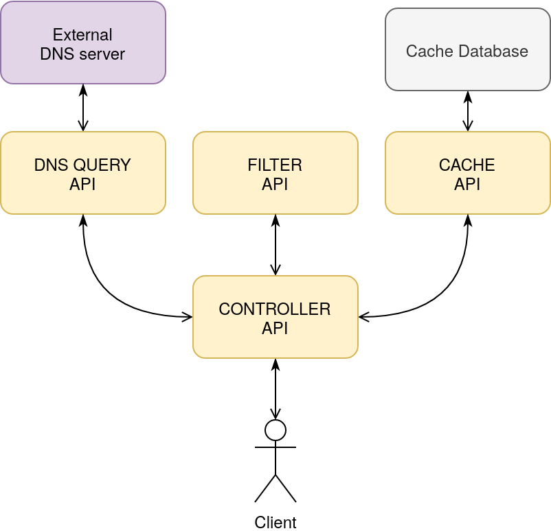
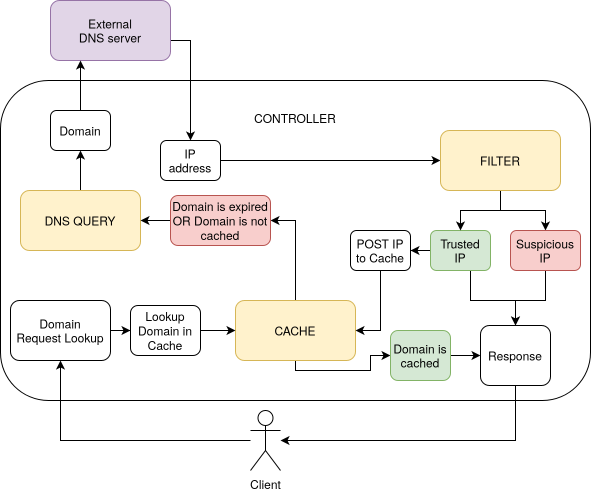

# DNS firewall

This DNS firewall is a prototype as part of a [bachelor thesis paper](https://www.umu.se/) by Buster Hultgren Wärn. It is built together with Tony Berglund, and all though he could not use the end results his bachelor thesis paper is available [here](https://www.umu.se/).

## Architecture

This firewall is built as a microservice with separate API's communicating with each other.

#### DNS controller

This micro service acts as the main controller for the service and controls the flow of the program. The client will only make requests to this API and ignore the others.

#### DNS caching

This API will handle simple caching. It have a GET and a PUT request. The GET request have domain as input and will output an IP address together with an expiration date. The PUT requst will input a domain, and IP address and an expiration date. This way it can easily cache domains with their IP addresses.

#### DNS Query

This API makes actual DNS queries to Cloudfares DNS server. It inputs a domain and outputs an IP address. It is the same as shown in Figure \ref{fig:dns_query_service}.

#### DNS filtering

The filtering is the actual firewall. This API takes an input of an IP address and returns score for how safe that address is considered to be. The score is between 0-100 where 0 is not trusted and 100 is trusted. This filtering can be implemented in multiple ways. In the implemented prototype the scoring engine will always return a score of 100 in a constant response time of 10ms.




#### Program flow

When a client makes a DNS request to the application, the flow of the program will work like this. First the controller will call the cache API to see if the domain is cached. If the domain is cached and has not expired, the IP address will be returned, and the controller will return the IP address. If not cached or if expired, the controller will call the DNS query API to get the IP address for that domain. Once the IP address is returned, the controller calls the Filter API with that IP address. The filter will return its score for that IP address. If the controller considers this score to be too low then it will not return the IP address to the client. If the IP address is considered to be trusted then two things will happen; the IP address will be returned to the client and the controller will call the cache API in order to cache the domain with an IP address with a TTL. This flow can be seen in the following figure.



# Usage

## Installation

This service is only tested for Node.js verison 12.16.2 and npm version 6.14.5.

Clone or download the git repository. From this directory `secure-dns-cloud-service/DNS_firewall` run the following command to install npm packgages.

```bash
$ npm install
```

This will install all dependencies for all node modules.